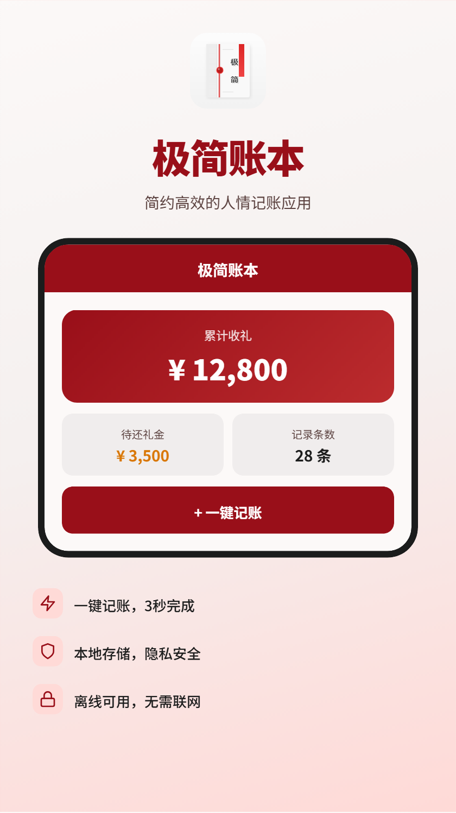
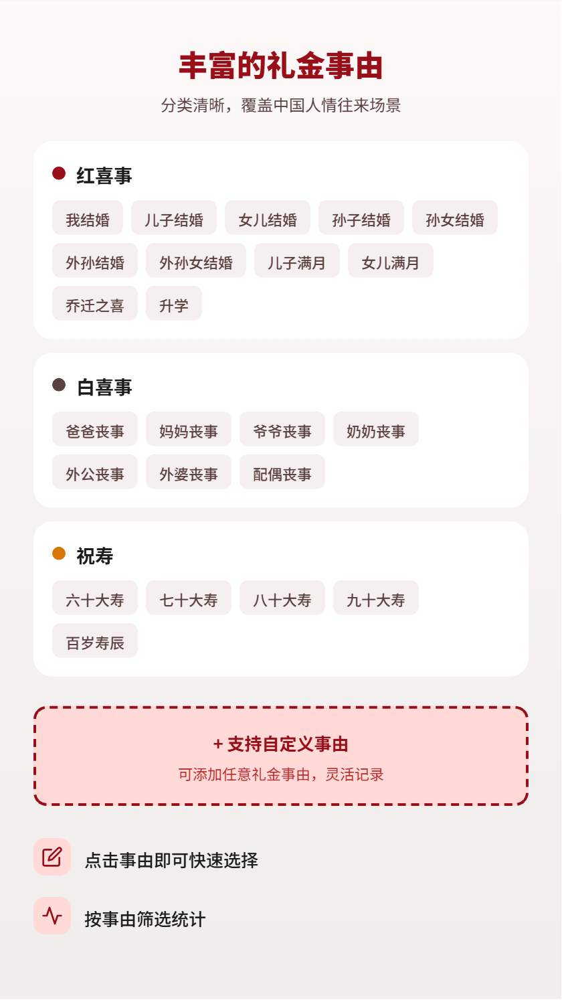
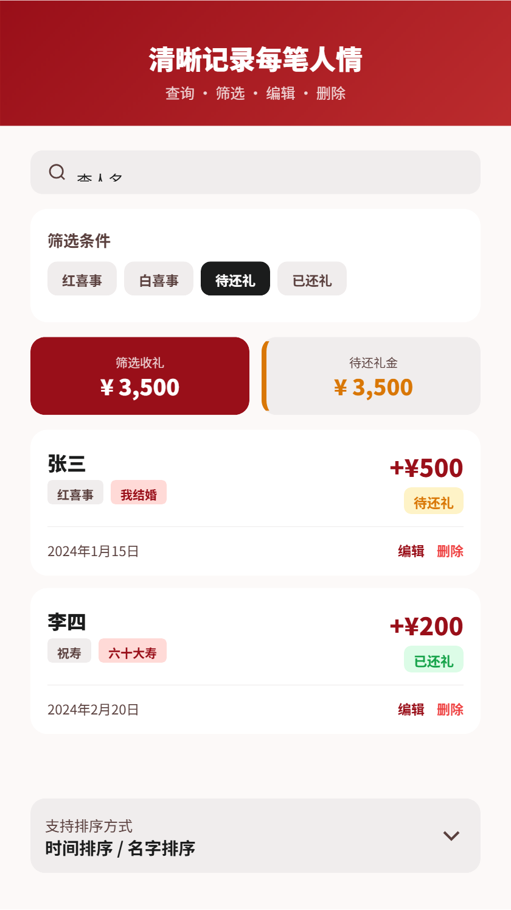
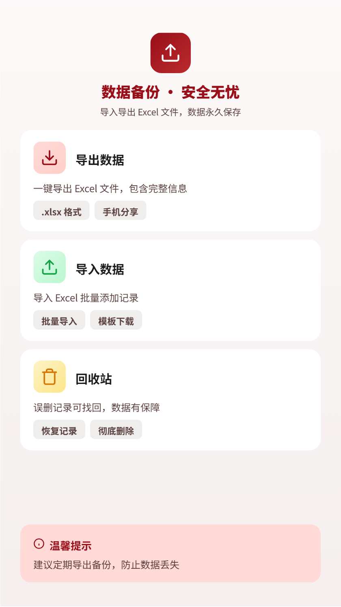
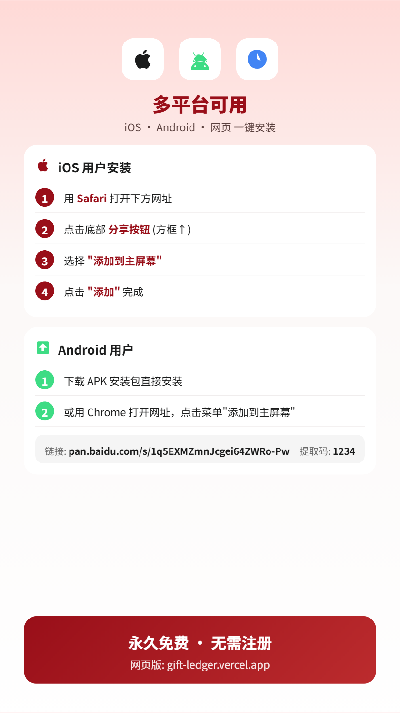

# 极简账本

一个简单易用的礼金（红包）记账应用，帮助用户记录和查询人情往来的礼金记录。

## 功能特点

- **查询功能**：按姓名、关系、事由等关键词搜索礼金记录
- **添加记录**：记录礼金支出详情（姓名、关系、事由、金额、日期、地址等）
- **记录管理**：查看详情、标记已还/未还、编辑、删除记录
- **数据统计**：首页显示总记录数、总金额、未还记录数
- **本地存储**：所有数据存储在浏览器本地，无需网络连接
- **移动端优化**：适配手机屏幕，大字体、简单操作
- **PWA 支持**：可安装到手机主屏幕，支持离线使用

## 技术栈

- Vue.js 3 - 前端框架
- Tailwind CSS - 样式框架
- Capacitor - 跨平台原生应用
- PWA - 渐进式 Web 应用

## 在线使用

- **国内直连**：https://gift.leevaluder.top
- **国外直连**：https://gift-ledger.vercel.app

## 安装到手机

### iOS 用户（iPhone/iPad）

1. 用 **Safari 浏览器** 打开 https://gift.leevaluder.top
2. 点击底部的 **分享按钮** (方框里有向上箭头)
3. 向下滑动，点击 **"添加到主屏幕"**
4. 点击 **"添加"**

安装后，应用会像原生 App 一样出现在主屏幕上，可离线使用。

### Android 用户

#### 方式一：安装 APK
百度网盘下载：https://pan.baidu.com/s/1q5EXMZmnJcgei64ZWRo-Pw 提取码：`1234`

（需要开启"允许安装未知来源应用"）

#### 方式二：PWA 安装
1. 用 Chrome 打开 https://gift.leevaluder.top
2. 点击右上角菜单 ⋮
3. 选择 **"添加到主屏幕"** 或 **"安装应用"**

## 快速开始

### 安装依赖
```bash
npm install
```

### 启动开发服务器
```bash
npm run dev
```

### 构建生产版本
```bash
npm run build
```

## 使用说明

### 1. 首页
- 查看统计信息（总记录、总金额、未还记录）
- 查看最近添加的记录
- 快速导航到查询和添加页面

### 2. 查询页面
- 在搜索框输入关键词（姓名、关系、事由）
- 使用筛选器按还款状态和排序方式过滤结果
- 点击记录查看详情

### 3. 添加记录页面
- 填写基本信息：姓名、关系、事由
- 填写金额、日期、地址（可选）、备注（可选）
- 保存记录

### 4. 记录详情页面
- 查看记录完整信息
- 标记为已还/未还
- 编辑或删除记录

## 数据存储

- 所有数据存储在浏览器的 LocalStorage 中
- 数据键名：`gift_records`
- 数据格式：JSON 数组
- 应用完全离线可用
- 支持导出 Excel 备份

## 应用截图

<div align="center">
  
  
</div>

<div align="center">
  
  
</div>

<div align="center">
  
  
</div>

## 目标用户

- 需要记录礼金往来的用户
- 希望简化礼金记账流程的用户
- 需要离线使用的场景

## 注意事项

1. 数据仅存储在本地浏览器，清除浏览器数据将丢失所有记录
2. 建议定期使用导出功能备份数据
3. 应用设计简洁，适合不熟悉复杂操作的用户

## 许可证

MIT
